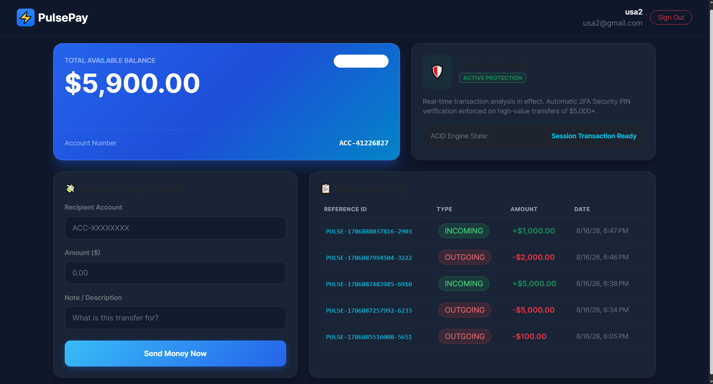
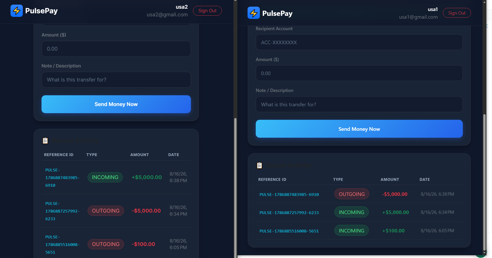
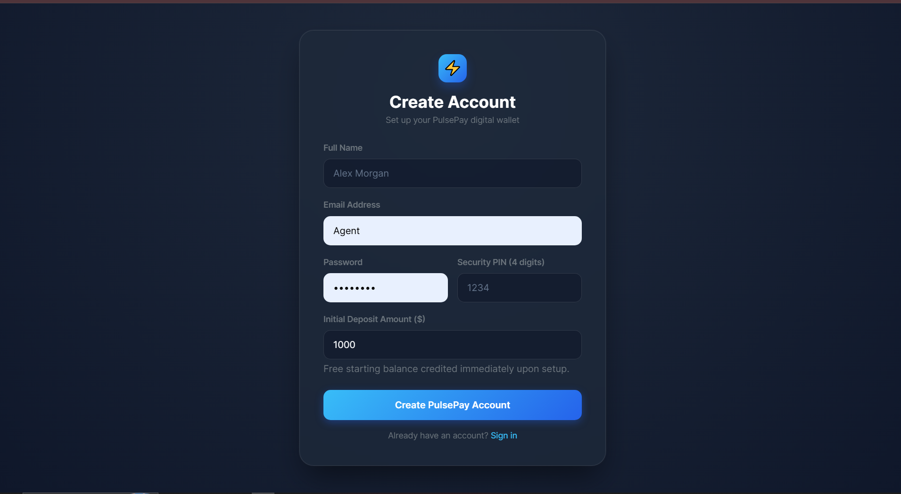
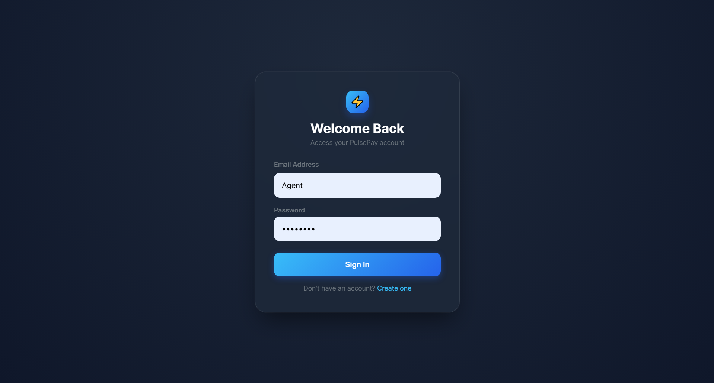

# ⚡ PulsePay

### Enterprise Digital Banking & Real-Time Payment Platform

A scalable, high-performance digital banking portal featuring real-time WebSocket notifications, MongoDB ACID money transfers, AI-powered fraud protection, and a modern dark glassmorphism UI.

---

### ⭐ Enterprise FinTech Portfolio Project

---

# 📸 Project Preview

## Dashboard & Dark Glassmorphism UI

---

## Real-Time Payment Notifications (SOCKET.IO)

---

## AI Fraud Shield 2FA Verification ($5,000+)

---

## Instant Money Transfer

---

## Registration & Dynamic Account Provisioning

---

# ✨ Features

### Banking & Transfers
- **ACID Money Transfers**: Atomicity and data integrity guaranteed via MongoDB session transactions.
- **Dynamic Account Provisioning**: Automated creation of active bank accounts during registration with customizable initial deposits.
- **Real-Time WebSockets**: Instant payment notifications and live balance updates powered by Socket.io room events.
- **Instant Beneficiary Search**: Transfer funds directly using account numbers with instant recipient resolution.

### Security & AI
- **AI Fraud Shield**: Automatic step-up 4-digit PIN verification enforced on high-value transfers exceeding **$5,000**.
- **2FA Verification**: Encrypted PIN hashing via bcrypt.js for step-up security.
- **JWT Authentication**: Bearer token authentication with automated session persistence and state management.

### Dashboard & Analytics
- **Live Account Balance**: Real-time reactive balance updates via Angular Signals.
- **Transaction History**: Searchable, filterable transaction logs with status badges.
- **Account Overview**: Copy-to-clipboard account numbers and quick financial metrics.

---

# 🛠 Tech Stack

## Frontend

- Angular 18 (Standalone Components)
- TypeScript
- RxJS & Angular Signals
- Bootstrap 5
- SCSS (Custom Glassmorphism Theme)
- Socket.io Client

## Backend

- Node.js
- Express.js
- MongoDB & Mongoose (ACID Transactions)
- Socket.io
- JWT (JSON Web Tokens)
- bcrypt.js

## Tools & Services

- Git & GitHub
- Postman
- MongoDB Atlas
- VS Code

---

# 📂 Folder Structure

pulsepay
│
├── pulsepay-frontend
│   └── src
│       └── app
│           ├── core
│           │   ├── guards
│           │   ├── interceptors
│           │   ├── models
│           │   └── services
│           │       ├── auth.ts
│           │       ├── socket.ts
│           │       └── transfer.ts
│           └── pages
│               ├── dashboard
│               ├── login
│               └── register
│
└── pulsepay-backend
    └── src
        ├── config
        │   └── db.ts
        ├── controllers
        │   ├── auth.controller.ts
        │   ├── transaction.controller.ts
        │   └── transfer.controller.ts
        ├── models
        │   ├── account.model.ts
        │   ├── transaction.model.ts
        │   └── user.model.ts
        ├── routes
        │   ├── auth.routes.ts
        │   ├── transaction.routes.ts
        │   └── transfer.routes.ts
        └── server.ts

---

# 🚀 Getting Started

## Clone Repository

git clone https://github.com/syedusamaali-dev/pulsepay-frontent.git

## Open Project

cd PulsePay

## Install Dependencies

npm install

## Run Project

npm run start

## Open

http://localhost:4200

---

# 🗺 Development Roadmap

## Phase 1

- ✅ Angular 18 Setup
- ✅ Glassmorphism UI Theme
- ✅ Dashboard & Authentication Layout

## Phase 2

- ✅ User Registration & Dynamic Deposit
- ✅ Active Bank Account Provisioning
- ✅ JWT Authentication & Password/PIN Hashing

## Phase 3

- ✅ MongoDB ACID Transaction Engine
- ✅ Peer-to-Peer Fund Transfers
- ✅ Socket.io Real-Time Room Notifications

## Phase 4

- ✅ AI Fraud Shield ($5,000+ Step-Up 2FA PIN)
- ✅ Live Balance Signals & Activity Table

## Phase 5

- ⏳ Interactive Spending Analytics Charts
- ⏳ Downloadable PDF Receipts
- ⏳ Multi-Currency Support

## Phase 6

- Docker
- CI/CD
- Deployment
- Production Release

---

# 🚀 Future Features

- Multi-Currency Conversion Engine
- Biometric & FaceID Authentication
- Savings Vaults & Automated Round-Ups
- Virtual Card Generation
- Scheduled & Recurring Transfers
- Advanced Fraud Pattern Analytics
- Dark / Light Theme Toggle
- Push Notifications
- Responsive Mobile App
- Multi-Language Support

---

# 🤝 Contributing

Contributions are welcome.

1. Fork the repository
2. Create a feature branch
3. Commit your changes
4. Push your branch
5. Open a Pull Request

---

# 📄 License

Licensed under the MIT License.

---

# 👨‍💻 Author

### Usama Ali

GitHub: https://github.com/syedusamaali-dev

---

## ⭐ If you like this project, don't forget to Star the repository!